# DDTank Universe

  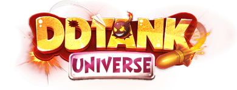

## 📋 Sobre o Projeto

DDTank Universe é uma versão personalizada do clássico jogo DDTank, oferecendo uma experiência única para os jogadores. O projeto está online há 5 meses e mantém uma média diária de 50 jogadores ativos.

## 🎮 Características

- Sistema de batalha em turnos
- Personalização de personagens
- Eventos especiais
- Sistema de Guilds
- Torneios semanais
- Cupons por batalha

## 🖼️ Screenshots

### Login e Cadastro

  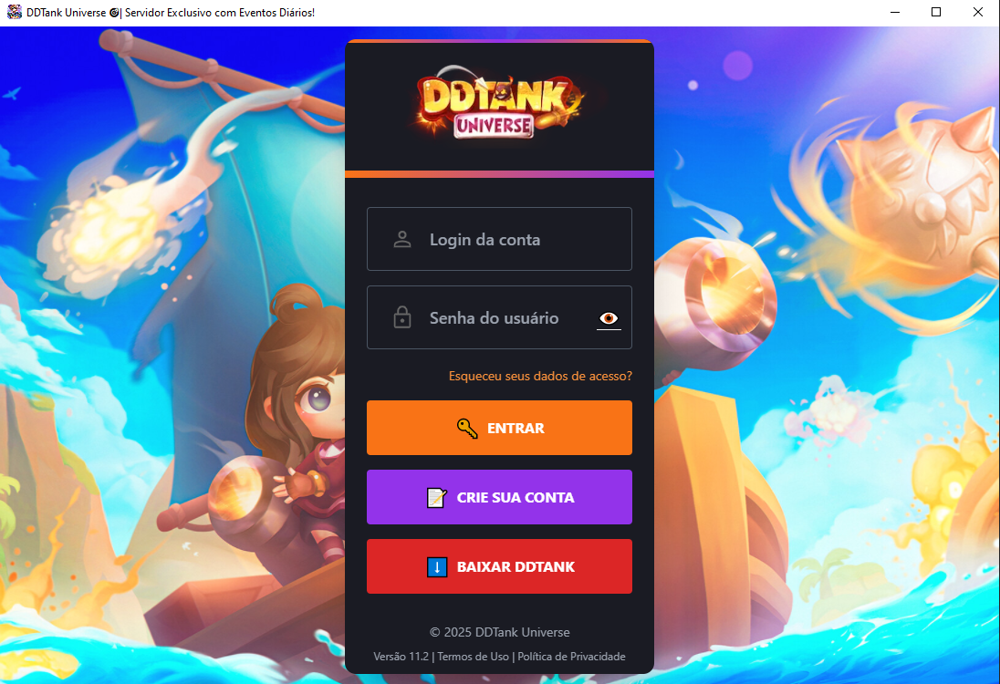
  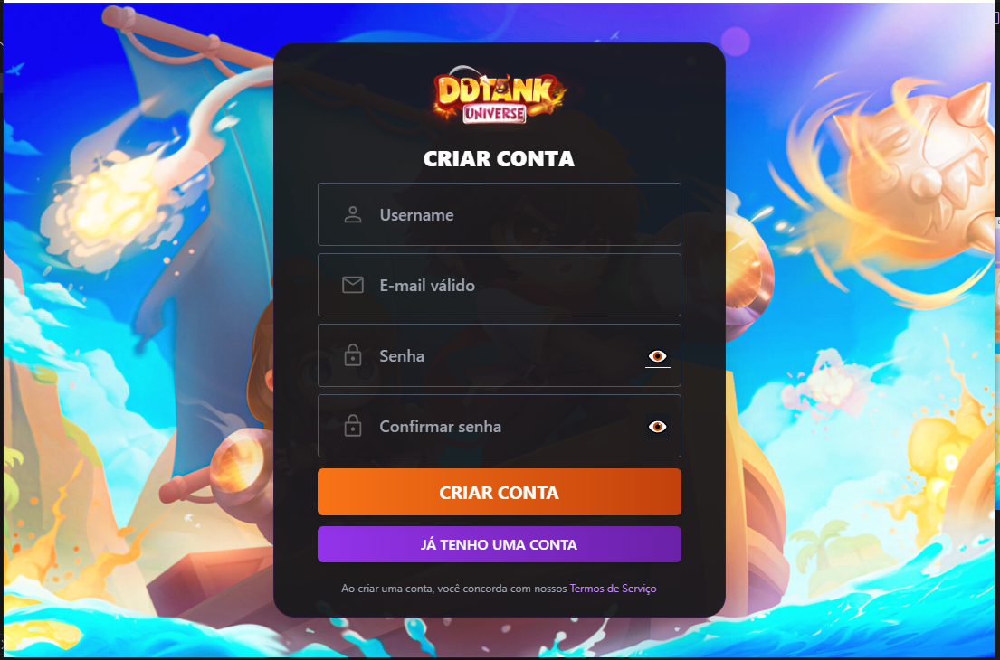

### Seleção de Servidor

  

### Seleção de Personagem

  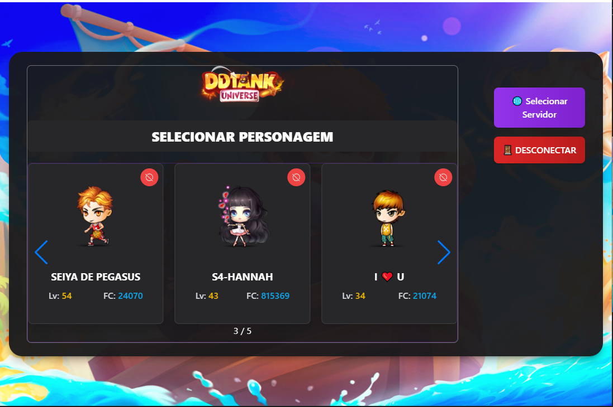

### Area do Usuário

  

### Ferramentas

  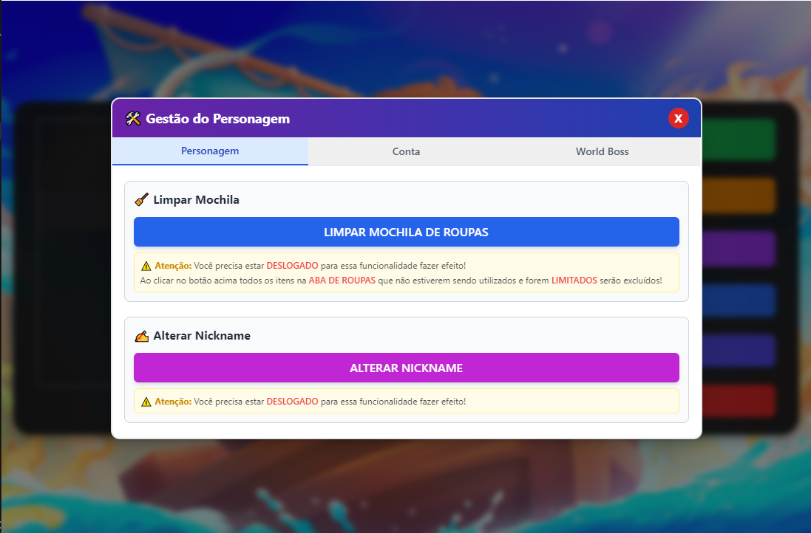

### Area de Recargas

  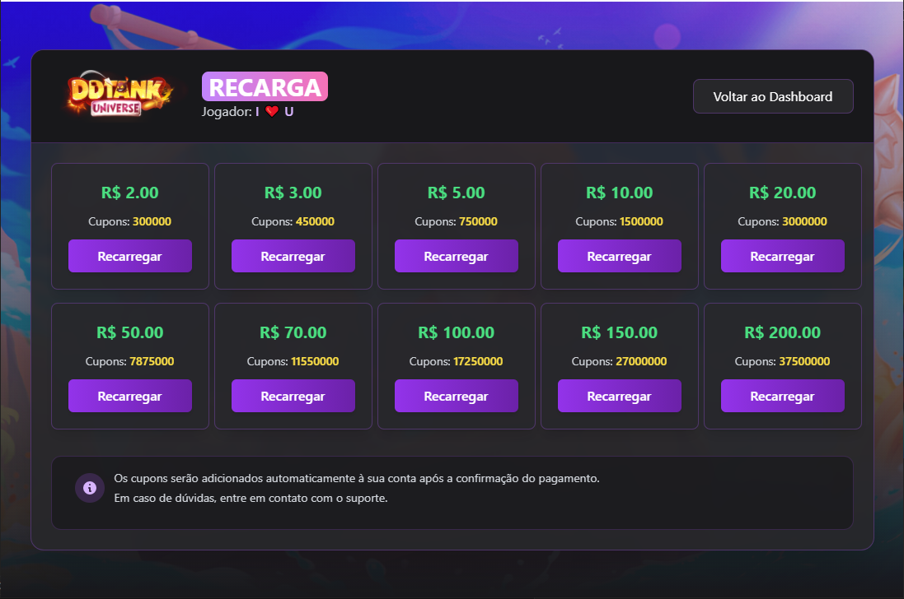
  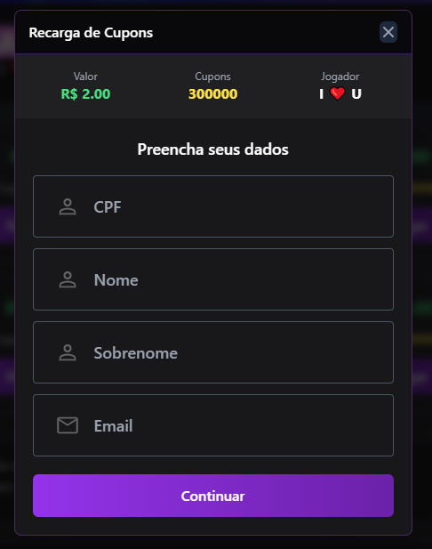
  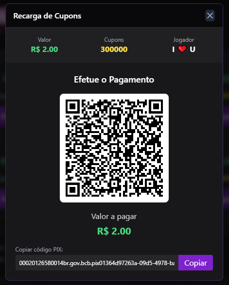

### Troca de pontos Chefe Mundial

  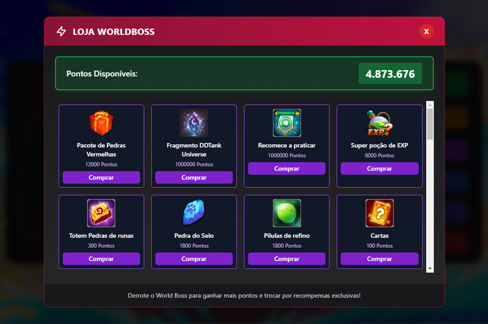

### Ranking PVP

  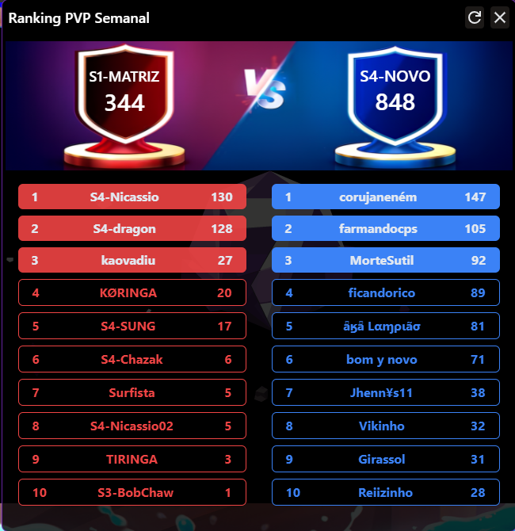

### Criação de Personagem

  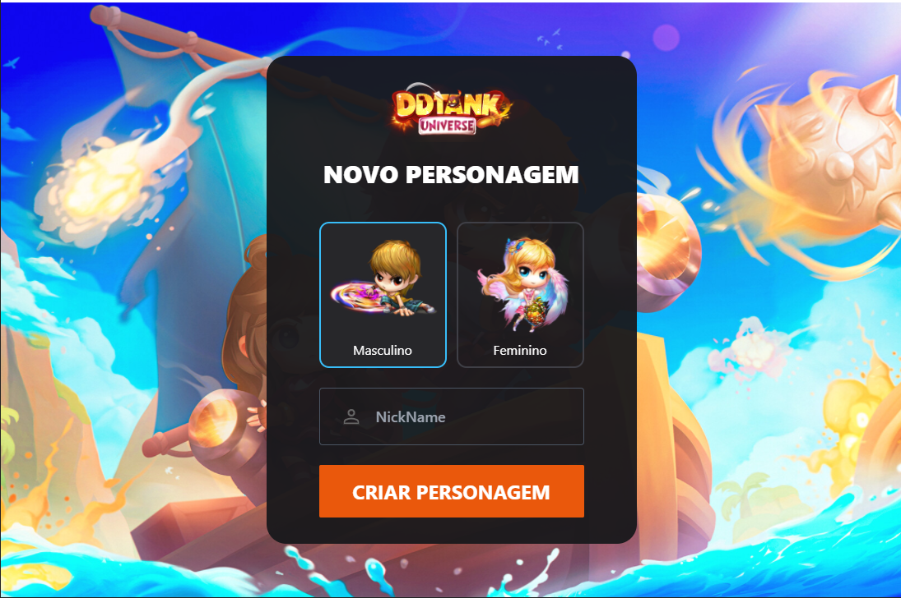

## 🛠️ Tecnologias Utilizadas

### Frontend
- NodeJS
- NextJS
- Swiper
- ActionScript 3 (InGame)
- Adobe Air (InGame)

### Backend

- Bcrypt
- JsonWebToken
- MercadoPago api
- Typeorm
- Nginx
- Express.Js
- MSSQL
- IIS
- SocketTCP (Backend InGame)
- C# (Backend InGame)

## 📊 Estatísticas

- **Tempo online:** 5 meses
- **Média de jogadores diários:** 50
- **Total de contas criadas:** + de 400
- **Pico de jogadores simultâneos:** 61

## 🚀 Como Jogar

1. Acesse https://ddtankuniverse.com.br
2. Crie sua conta
3. Baixe o cliente (se necessário)
4. Entre no jogo e divirta-se!

## 👥 Equipe

- [Lucas Amaral] - [Desenvolvedor Fullstack]
- [Gabriel Kauer] - [Desenvolvedor Fullstack]
- [Thonny Mendes] - [Game Balancer]

## 📞 Contato

- Discord: https://discord.gg/TGWRJRXU
- Email: contato@ddtankuniverse.com.br
- Site: ddtankUniverse.com.br

<!-- ## 📸 Mais Imagens

  
  
  

 -->

---

  Desenvolvido com ❤️ por Lucas Amaral e Gabriel Kauer

